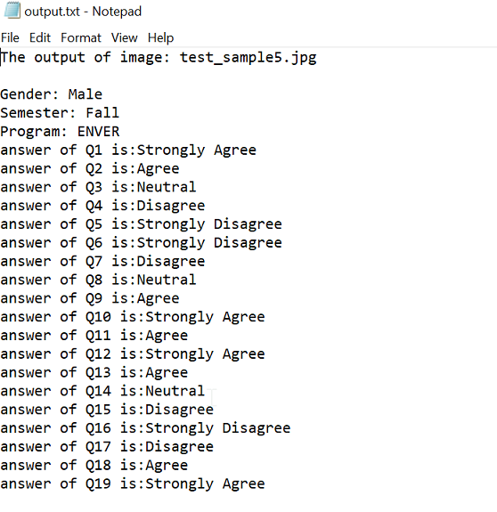

## Optical character scanner (OMR) for bubble sheet
The project can extract answers from upright or slightly tilted images using various hough transforms from opencv
### Template

### Running the project
run main.py then enter the image file name like so
```
test_sample1.jpg
```
### Example

### Screen shot of output

